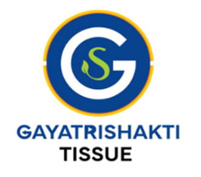

# Tissue Manufacturing QA Dashboard

A comprehensive React-based quality assurance dashboard for tissue manufacturing, designed for Gayatri Shakti. This application provides real-time quality monitoring, trend analysis, and advanced analytics for tissue production data.



## Features

### 📊 Data Management
- **Excel File Upload**: Supports .xlsx, .xls, and .xlsm files with drag-and-drop functionality
- **Intelligent Column Mapping**: Automatically detects and maps over 50 quality parameters
- **Date Format Support**: Handles various date formats including "1-Jan-25" format

### 📈 Quality Monitoring
- **Daily Reports**: View comprehensive quality metrics for any selected date
- **Real-time Status**: Color-coded indicators for in-spec/out-of-spec parameters
- **Production Metadata**: Track shifts, operators, lot numbers, and machine parameters

### 📉 Analytics & Visualization
- **Trend Analysis**: Daily, weekly, and monthly trend charts with control limits
- **Process Capability (Cpk)**: Calculate and visualize process performance metrics
- **Quality Score Tracking**: Monitor overall quality performance over time
- **Issue Identification**: Automatic detection of most frequent out-of-spec parameters

### 🎨 User Experience
- **Dark Mode**: Toggle between light and dark themes
- **Responsive Design**: Optimized for desktop, tablet, and mobile devices
- **Advanced Filtering**: Search and filter through historical data
- **Export Capabilities**: 
  - Download comprehensive PDF reports for any date
  - Export data as CSV for further analysis
  - Save trend charts as PNG images

## Tracked Parameters

### Production Metadata
- Date, Time, Shift, Lab Executive, Machine Shift Incharge
- Lot No, Roll No, Spool No

### Product Quality Metrics
- GSM (Grammage) with LCL/UCL
- Thickness (μm) with LCL/UCL
- Bulk (cc/gm) with LCL/UCL
- Dry Strength (MD/CD) with LCL/UCL
- MD/CD Ratio
- Stretch/Elongation %
- Wet Tensile (gf/50mm)
- Wet/Dry Tensile Ratio (%)
- Brightness % ISO with LCL/UCL
- Opacity % with LCL/UCL
- Moisture % with LCL/UCL

### Machine Parameters
- Machine Speed (Mpm)
- Pope Reel Speed (Mpm)
- MC Draw, Blade, Press Load
- Coating parameters

### Fiber Composition
- HW/SW Grade and properties
- Short/Long Fiber percentages
- Broke percentage
- Consumption rates (WSR/DSR)

## Installation

1. Clone the repository:
```bash
git clone git@github.com:kod-er/tissue_manufacturing_QA_dashboard.git
cd tissue-qa-dashboard
```

2. Install dependencies:
```bash
npm install
```

3. Start the development server:
```bash
npm start
```

The application will open at http://localhost:3000

## Usage

1. **Upload Data**: Click the upload button or drag-and-drop your Excel file containing quality data
2. **Navigate**: Use the tab navigation to switch between different views
3. **Select Date**: In the Daily Report, use the date selector to view specific day's data
4. **Analyze Trends**: Switch to Trend Analysis to view performance over time
5. **Export Data**: Use the export button in the Data Table to download CSV

## Excel File Requirements

- Must contain a sheet named "DATA"
- First column should contain dates (supports formats like "1-Jan-25")
- Column headers should match the parameter names (fuzzy matching is supported)
- Control limits (LCL/UCL) can be included as separate columns

## Technology Stack

- **Frontend**: React 18 with TypeScript
- **UI Framework**: Material-UI v5
- **Charts**: Recharts
- **Excel Processing**: SheetJS (xlsx)
- **Date Handling**: Day.js
- **State Management**: React Hooks

## Browser Support

- Chrome (latest)
- Firefox (latest)
- Safari (latest)
- Edge (latest)

## Development

### Available Scripts

- `npm start` - Run development server
- `npm test` - Run tests
- `npm run build` - Build for production
- `npm run eject` - Eject from Create React App

### Project Structure

```
src/
├── components/
│   ├── FileUpload.tsx      # Excel file upload component
│   ├── DailyReport.tsx     # Daily quality report view
│   ├── TrendAnalysis.tsx   # Trend charts and analysis
│   ├── AdvancedMetrics.tsx # Process capability and analytics
│   └── DataTable.tsx       # Searchable data table with export
├── utils/
│   ├── columnMappings.ts   # Excel column mapping configuration
│   └── analyzeExcel.ts     # Excel file structure analyzer
├── types.ts                # TypeScript interfaces
├── theme.ts                # Material-UI theme configuration
└── App.tsx                 # Main application component
```

## Contributing

1. Fork the repository
2. Create your feature branch (`git checkout -b feature/AmazingFeature`)
3. Commit your changes (`git commit -m 'Add some AmazingFeature'`)
4. Push to the branch (`git push origin feature/AmazingFeature`)
5. Open a Pull Request

## License

This project is proprietary software for Gayatri Shakti.

## Support

For support and questions, please contact the development team.

---

Developed for Gayatri Shakti - Excellence in Tissue Manufacturing